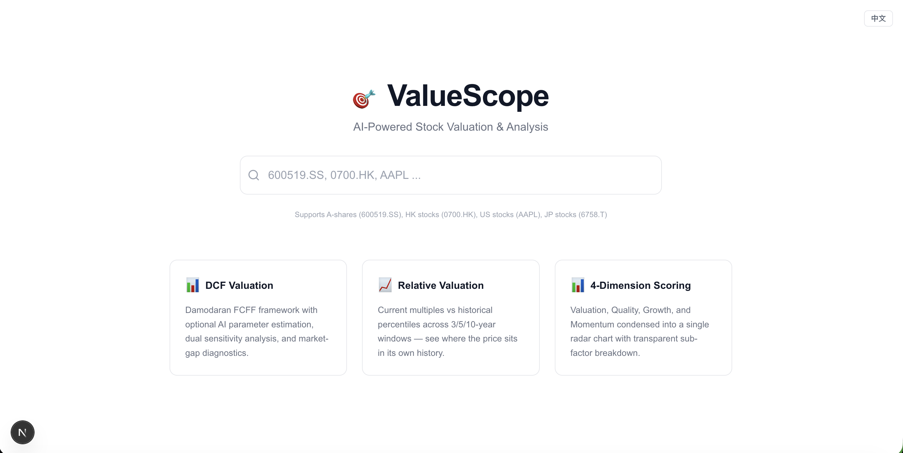
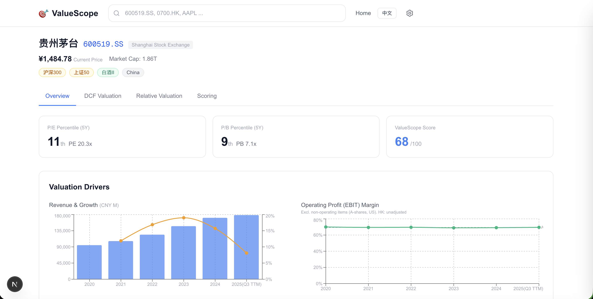
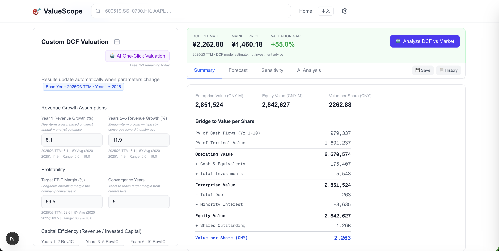
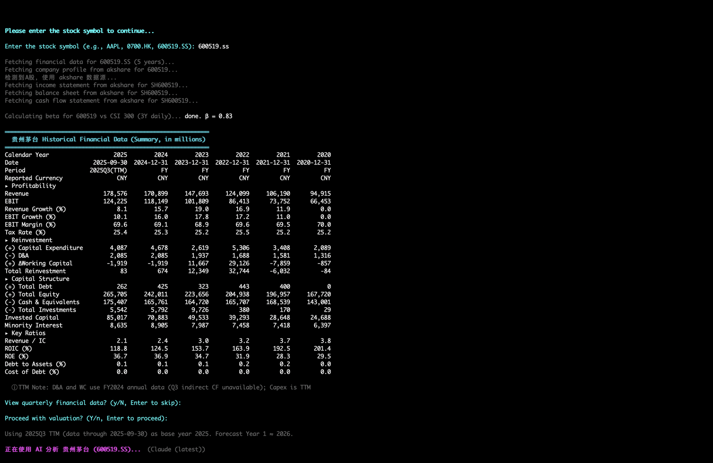
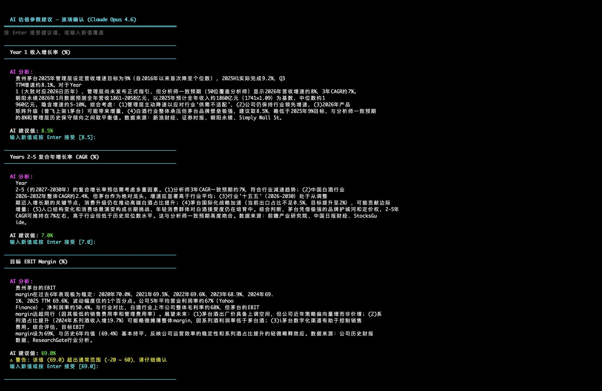
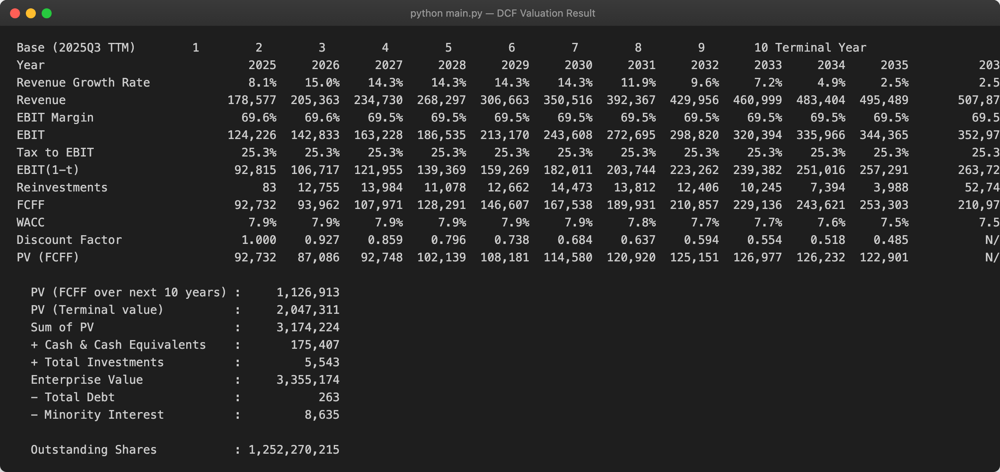

## Language
- [English](README.md)
- [中文](README_zh.md)

---

# ValueScope

**AI-powered stock valuation & analysis platform — DCF valuation, relative valuation, multi-dimensional scoring, and financial analysis.**

[](https://valuescope.app)
[](LICENSE)
[](https://www.python.org/)
[](https://nextjs.org/)

---

## What is ValueScope?

ValueScope is an AI-powered stock valuation platform built on a **standardized Damodaran FCFF DCF engine** — 10-year explicit forecast, terminal value, WACC, and sensitivity analysis in a fixed, reproducible framework. Unlike asking an LLM to "value this stock" (where every conversation may use a different method), ValueScope produces **consistent, comparable results** across companies and time periods.

Think of it as having an equity research analyst sitting next to you: AI searches for earnings guidance, analyst consensus, and industry benchmarks, then suggests valuation parameters — but the underlying model is always rigorous, transparent, and under your control.

**Supported Markets:** 🇺🇸 US &nbsp; 🇭🇰 Hong Kong &nbsp; 🇨🇳 A-shares &nbsp; 🇯🇵 Japan

---

## Web App

Try it at **[valuescope.app](https://valuescope.app)** — no installation required.

### Web App — Landing Page



### Web App — Overview & Valuation Drivers



### Web App — DCF Valuation



---

## Key Features

### Web App ([valuescope.app](https://valuescope.app))

- **DCF Valuation** — Damodaran FCFF framework with interactive parameter controls, 10-year forecast table, dual sensitivity analysis (Growth×Margin, WACC), and bridge-to-value breakdown.
- **AI One-Click Valuation** — Cloud AI (DeepSeek R1 + Serper web search) analyzes earnings guidance, analyst consensus, and industry data to suggest all DCF parameters with detailed reasoning. Free quota included; bring your own keys for unlimited use.
- **Gap Analysis** — AI compares your DCF estimate against market price, considering sentiment, analyst targets, and risk factors.
- **Relative Valuation** — Current multiples (PE, PB, PS, EV/EBITDA) vs historical percentiles across 3/5/10-year windows.
- **4-Dimension Scoring** — Valuation, Quality, Growth, and Momentum condensed into a radar chart with transparent sub-factor breakdown.
- **Financial Overview** — Key drivers (revenue growth, EBIT margin, ROIC, FCF), balance sheet highlights, and historical financial table.
- **Bilingual UI** — English and Chinese with one-click toggle.

### Terminal CLI

- **AI Copilot** — Three local AI engines (Claude, Gemini, Qwen). AI suggests parameters; you review and adjust interactively.
- **Custom Valuation** — Full manual control with `--manual`. No AI or API key required.
- **Auto Mode** — Fully automated: AI → accept → export Excel with `--auto`.
- **Excel Export** — Formatted `.xlsx` workbook with valuation results, historical data, and AI analysis.

### Terminal Demo





---

## Architecture

```
valuescope/
├── frontend/          # Next.js 15 (React) — web UI
├── backend/           # FastAPI — REST API server
├── modeling/          # Core valuation engine (shared by CLI & backend)
├── main.py            # Terminal CLI entry point
└── Dockerfile         # Backend container
```

---

## Data Sources & FMP API Key

| Market | Data Source | API Key |
|--------|-----------|---------|
| **A-shares** | akshare | Not required (free) |
| **Hong Kong** | yfinance (annual) / FMP (quarterly) | Annual: free; Quarterly: FMP key |
| **US** | FMP | FMP key required |
| **Japan** | FMP | FMP key required |

> 💡 **[Get FMP API Key →](https://site.financialmodelingprep.com/pricing-plans?couponCode=valuescope)**
>
> FMP (Financial Modeling Prep) provides high-quality financial data for US, HK, and JP markets. **Buy through this link for a discounted price** — it also supports ValueScope's ongoing development.

---

## AI Engines

### Cloud AI (Web App)

The web app at [valuescope.app](https://valuescope.app) uses built-in Cloud AI — no installation required:

- **DeepSeek R1** — Deep chain-of-thought reasoning for financial analysis
- **Serper** — Google search + page scraping for earnings guidance, analyst forecasts, and industry data
- **Free quota included** — bring your own Serper + DeepSeek keys for unlimited use

### Local AI Engines (Terminal CLI)

ValueScope supports three local AI CLI tools. Auto-detects installed engines (priority: Claude > Gemini > Qwen), or force one with `--engine`.

| Engine | Install | Notes |
|--------|---------|-------|
| **Claude** | `npm install -g @anthropic-ai/claude-code` | Default if available. Requires [Anthropic](https://docs.anthropic.com/en/docs/claude-code) account. |
| **Gemini** | `npm install -g @google/gemini-cli` | Free with [Google](https://github.com/google-gemini/gemini-cli) account. |
| **Qwen** | `npm install -g @anthropic-ai/qwen-code` | Free with [qwen.ai](https://github.com/QwenLM/qwen-code) account. |

If no AI engine is detected, ValueScope falls back to custom valuation mode (manual input).

---

## Installation & Usage

### Option 1: Use the Web App (Recommended)

Visit **[valuescope.app](https://valuescope.app)** — no installation needed.

### Option 2: Terminal CLI

Requires Python 3.8+.

```bash
git clone https://github.com/alanhewenyu/ValueScope.git
cd ValueScope
pip install -r requirements.txt
```

Set FMP API Key (required for US/Japan):

```bash
export FMP_API_KEY='your_api_key_here'
```

Run:

```bash
python main.py                    # AI copilot (default)
python main.py --manual           # Manual input
python main.py --auto             # Fully automated
```

Additional flags: `--engine claude|gemini|qwen`, `--apikey YOUR_KEY`.

---

## Key Valuation Parameters

| Parameter | Description |
|-----------|-------------|
| **Revenue Growth (Year 1)** | Next year's revenue forecast. AI prioritizes company guidance, then analyst consensus. |
| **Revenue Growth (Years 2-5)** | Compound annual growth rate (CAGR) for years 2-5. |
| **Target EBIT Margin** | Expected EBIT margin at maturity. |
| **Revenue/Invested Capital** | Capital efficiency ratio for different periods. |
| **WACC** | Auto-calculated from risk-free rate, ERP, and beta; adjustable. |
| **RONIC** | Return on new invested capital in terminal period. Defaults to WACC. |

---

## Contributing

Issues and pull requests are welcome. Contact: [alanhe@icloud.com](mailto:alanhe@icloud.com)

For more on company valuation, visit [jianshan.co](https://jianshan.co) or scan to follow on WeChat:


---

## License

This project is licensed under the [GNU Affero General Public License v3.0 (AGPL-3.0)](LICENSE).

This means you are free to use, modify, and distribute this software, but any modified version — including use as a network service (SaaS) — must also be open-sourced under AGPL-3.0.

© 2025-2026 Alan He
