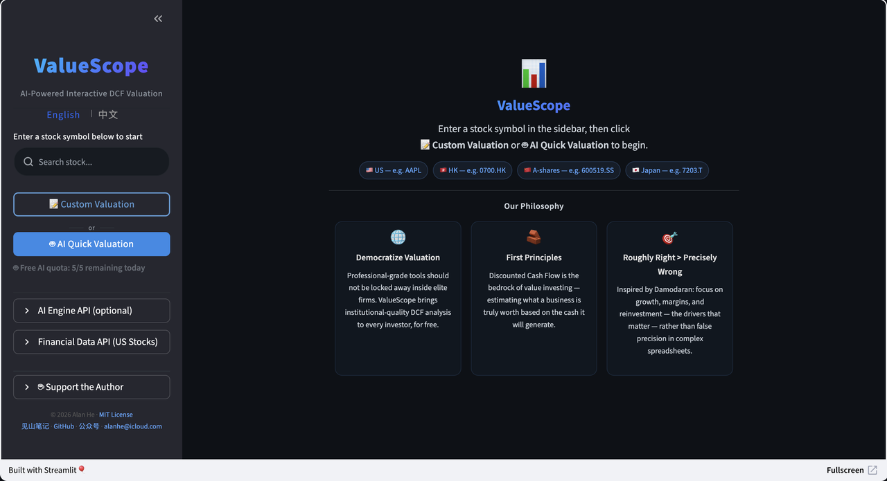

## 语言选择
- [English](README.md)
- [中文](README_zh.md)

---

# ValueScope

**AI 驱动的交互式 DCF 股票估值工具 — 标准化模型、实时调参、可复现结果。**

[](https://valuescope.app)
[](LICENSE)
[](https://www.python.org/)

---

## ValueScope 是什么？

ValueScope 是一个基于**标准化 DCF 引擎**的 AI 股票估值工具 — 10 年 FCFF 显性预测期、终值、WACC、敏感性分析，框架固定、结果可复现。与直接让大模型"估个值"不同（每次对话可能用不同的方法和折现框架），ValueScope 产出**一致、可比较的估值结果**，为投资决策提供可靠依据。

你可以把它想象成一位坐在身边的股权研究分析师：AI 帮你搜索业绩指引、分析师一致预期和行业数据，然后给出估值参数建议 — 而底层模型始终是严谨、透明、由你掌控的。

**支持市场：** 🇺🇸 美股 &nbsp; 🇭🇰 港股 &nbsp; 🇨🇳 A 股 &nbsp; 🇯🇵 日股

---

## 演示

### 在线网页版 — 首页



### 在线网页版 — 估值判定 + 滑块调参


### 终端 CLI


---

## 核心功能

- **AI Copilot** — AI 联网搜索分析师预期、业绩指引和行业数据，为每个 DCF 参数给出建议值和详细分析。你逐项审核调整。
- **在线网页版** — 访问 [valuescope.app](https://valuescope.app)，内置 Cloud AI（DeepSeek R1 + Serper 联网搜索），无需安装。
- **终端 CLI** — 支持三种本地 AI 引擎：[Claude Code](https://docs.anthropic.com/en/docs/claude-code)、[Gemini CLI](https://github.com/google-gemini/gemini-cli)、[Qwen Code](https://github.com/QwenLM/qwen-code)。启动时自动检测，也可通过 `--engine` 指定。
- **自定义估值** — 通过滑块（网页版）或 `--manual`（终端）完全手动调参。无需 AI 引擎或 API Key。
- **估值判定与差异分析** — 买入/持有/卖出判定及安全边际。AI 对比 DCF 估值与市场价格和分析师目标价。
- **敏感性分析 & Excel 导出** — 收入增长率 × EBIT 利润率、WACC 敏感性分析表。一键导出格式化 `.xlsx` 工作簿。

---

## 数据源 & FMP API Key

| 市场 | 数据源 | API Key |
|------|-------|---------|
| **A 股** | [akshare](https://github.com/akfamily/akshare) | 不需要（免费） |
| **港股** | [yfinance](https://github.com/ranaroussi/yfinance)（年度）/ [FMP](https://site.financialmodelingprep.com/register)（季度） | 年度：免费；季度：需 FMP Key |
| **美股** | [FMP](https://site.financialmodelingprep.com/register) | 需要 FMP Key |
| **日股** | [FMP](https://site.financialmodelingprep.com/register) | 需要 FMP Key |

> 💡 **[获取 FMP API Key →](https://site.financialmodelingprep.com/register)**
>
> FMP（Financial Modeling Prep）提供美股、港股、日股等高质量金融数据。**通过此链接购买可享折扣价**，同时也是对 ValueScope 项目的支持。

---

## 安装与使用

```bash
# 1. 下载并安装依赖
git clone https://github.com/alanhewenyu/ValueScope.git
cd ValueScope
pip install -r requirements.txt

# 2. 设置 FMP API Key（美股/日股需要）
export FMP_API_KEY='your_key_here'

# 3.（可选）安装本地 AI 引擎
npm install -g @anthropic-ai/claude-code    # 或 @google/gemini-cli 或 @anthropic-ai/qwen-code

# 4. 运行
python main.py                    # 终端 CLI（AI copilot 模式）
python main.py --manual           # 终端 CLI（手动输入模式）
python main.py --auto             # 终端 CLI（全自动模式）
streamlit run web_app.py          # 本地网页版
```

> **不想安装？** 直接访问 [valuescope.app](https://valuescope.app) — Cloud AI（DeepSeek R1）已内置。

---

## 关键估值参数

| 参数 | 说明 |
|------|------|
| **收入增长率（Year 1）** | 未来一年收入预测。AI 优先参考公司业绩指引，其次参考分析师预期。 |
| **收入增长率（Years 2-5）** | 未来 2-5 年复合年增长率（CAGR）。 |
| **目标 EBIT 利润率** | 公司达到成熟稳定期的 EBIT 利润率。 |
| **收入/投资资本比率** | 不同阶段的资本效率比率。 |
| **WACC** | 基于无风险利率、股权风险溢价和 Beta 自动计算，可手动调整。 |
| **RONIC** | 终值期新投资资本回报率。默认等于 WACC。 |

---

## 贡献与反馈

欢迎提交 Issue 或 Pull Request。联系邮箱：[alanhe@icloud.com](mailto:alanhe@icloud.com)

了解更多公司估值内容，欢迎访问 [jianshan.co](https://jianshan.co) 或扫码关注微信公众号：**见山笔记**


---

## 许可证

MIT License。详见 [LICENSE](LICENSE)。
